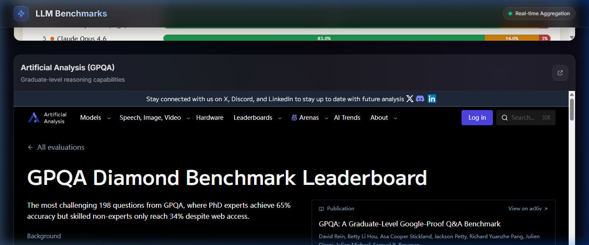
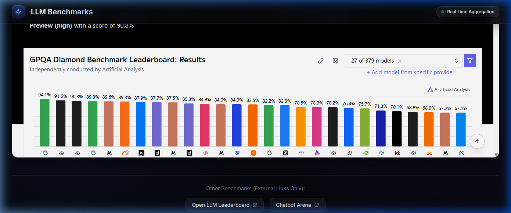
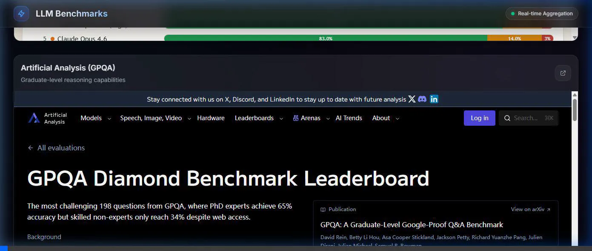

# LLM Benchmark Dashboard

A high-quality, State-Of-The-Art (SOTA) benchmark dashboard for aggregating LLM evaluation leaderboards into a single pane of glass.

## Features Implemented
- **Vite & React Setup**: Fast, modern SPA scaffolding.
- **Tailwind CSS v4**: Utilizes advanced Tailwind configuring including custom dark themes, CSS layer directives, and a tailored radial gradient background.
- **Dynamic Layout system**: A sleek grid that scales from 1 column on mobile to 2 columns on larger screens, containing the benchmark sources.
- **Glassmorphism Components**: The `BenchmarkCard` and `Header` components employ `backdrop-filter: blur`, subtle borders, and smooth hover animations.
- **Animated Loading States**: Embedded a custom loading spinner while iframes initialize.
- **Smart Fallback UI**: Sources that block iframe embedding gracefully present a fallback screen to open the leaderboard directly, rather than showing a broken connection window.

## Included Benchmarks

1. **[Bullshit Benchmark](https://petergpt.github.io/bullshit-benchmark/viewer/index.v2.html)**
   * **Focus:** Measuring LLM hallucination and refuse rates. 
   * **Description:** This benchmark aims to quantify how often language models confidently output false or nonsensical information (hallucinations) and how frequently they unnecessarily refuse to answer harmless prompts. It's crucial for understanding the reliability and safety alignment of models in practical, everyday scenarios.

2. **[Artificial Analysis (GPQA Diamond)](https://artificialanalysis.ai/evaluations/gpqa-diamond)**
   * **Focus:** Graduate-level reasoning capabilities.
   * **Description:** The Graduate-Level Google-Proof Q&A (GPQA) is an exceptionally difficult reasoning benchmark. It tests models on questions spanning biology, physics, and chemistry at a level that even highly educated human domains experts struggle with. It serves as a strong indicator of a model's advanced analytical and scientific reasoning skills.

3. **[Open LLM Leaderboard (HuggingFace)](https://huggingface.co/spaces/open-llm-leaderboard/open_llm_leaderboard#/)** *(External Link)*
   * **Focus:** Comprehensive standard evaluation suite for open-source models.
   * **Description:** Maintained by HuggingFace, this is the premier destination for tracking the performance of open-source language models. It aggregates results across a wide variety of standard NLP benchmarks (like ARC, HellaSwag, MMLU, Winogrande, GSM8k), providing a holistic view of a model's general capabilities compared to its peers.

4. **[Chatbot Arena](https://arena.ai/leaderboard/)** *(External Link)*
   * **Focus:** Crowdsourced blind testing & Elo rating.
   * **Description:** Developed by LMSYS Org, the Chatbot Arena takes a human-centric approach to model evaluation. Users are presented with two anonymous models and vote on which one provides a better response to a prompt. These human preference votes are then used to calculate an Elo rating, providing a highly realistic measure of how "helpful" a model feels to actual users.

*Note: Due to strict security policies (X-Frame-Options / Content-Security-Policy), HuggingFace and Chatbot Arena do not permit embedding inside an iframe. The dashboard handles this gracefully by providing direct links out to their respective platforms.*

## Visuals

### Dashboard Top View


### Dashboard Bottom View


### Dashboard Demo


## Run Locally
```bash
npm install
npm run dev
```
